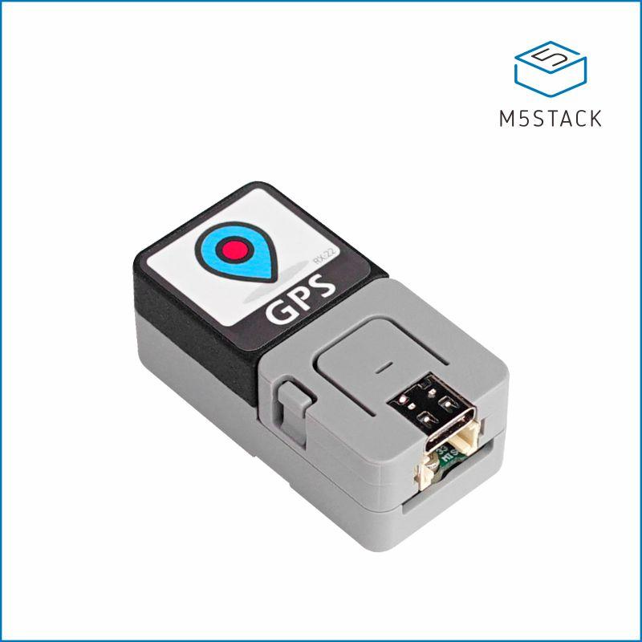

# Atom GPS logger

This repository shows how to use a [M5Stack Atom GPS kit](https://shop.m5stack.com/collections/m5-atom/products/atom-gps-kit-m8030-kt) to receive NMEA sentences from the GPS, parse and format them with the TinyGPS++ library, and and write the formatted data to the GPS kit's micro SD card. During setup, the Atom's RGB LED is used to display any errors initialising the the SD card, and while logging shows the quality of the GPS fix (Green=Good, Amber=ok, Red=bad).

This Atom GPS kit uses a [u-blox UBX-M8030-KT](https://www.u-blox.com/en/product/ubx-m8030-series#tab-document-resources) GPS chipset, part of the u-blox M8 GNSS series of GPS chips. This is a highly configurable GPS chip. **Inexplicably**, the M5Stack Atom GPS kit only connects the GPS's transmit (Tx) pin to the ESP, but not the Rx pin, therefore out of the box, the Atom GPS kit can't recive configuration commands from the ESP32. The main point of this repository is to show how to modify the GPS kit hardware so that the GPS module can be configured by serial commands. 

The main point of this repository is to show how with a simple one wire mod, you can connect the missing GPS Rx pin to the ESP32 and then configure the GPS by serial commands.

Why would you want to send commands to the GPS? Because by default the M8030-KT sends many NMEA sentence types (RMC, VTG, GGA, GSA, GSV, GLL) however TinyGPS only uses GGA and RMC, so the ESP32 has to process many many unnecessary characters and discard them. By sending config commands to the M8030-KT we can turn off the unnecessary GLL, GSV, GSA and VTG sentences.

Developed using the PlatformIO (PIO) microcontrolller IDE. PIO is a plugin for Visual Studio Code. The Arduino code framework is used.

<h2>I don't use M5Stack objects</h2>
With most M5Stack products, I choose not to use thier board object for various reasons. Mostly because their object often includes other Arduino libraries (for example FastLED and TFT_eSPI graphics) but they don't update thier object code when the inlcuded libraries are updated. Therefore you won't see my code include the M5Atom.h library, nor use M5.begin().

<h2>Hardware mod to connect the GPS Rx signal</h2>
You just need to solder in one very short piece of wire as follows.

1. Remove the Atom from the kit by unscrewing the M2x8mm bolt. Pop the Atom off.
2. Look under the black plastic cover, and disconnect the 4-pin cable from the GPS module.
3. Slide out the GPS module from under the black cover.
4. Pop off the black cover. It helps to use a small screwdriver or tweezers to release the side clips.
5. Solder a short length of wire from the 3rd pin on the 4-pin connector which is on the main PCB to pin 21 of the 4-pin header that the Atom normally plugs into.
6. Re-assemble everything. That's it!

